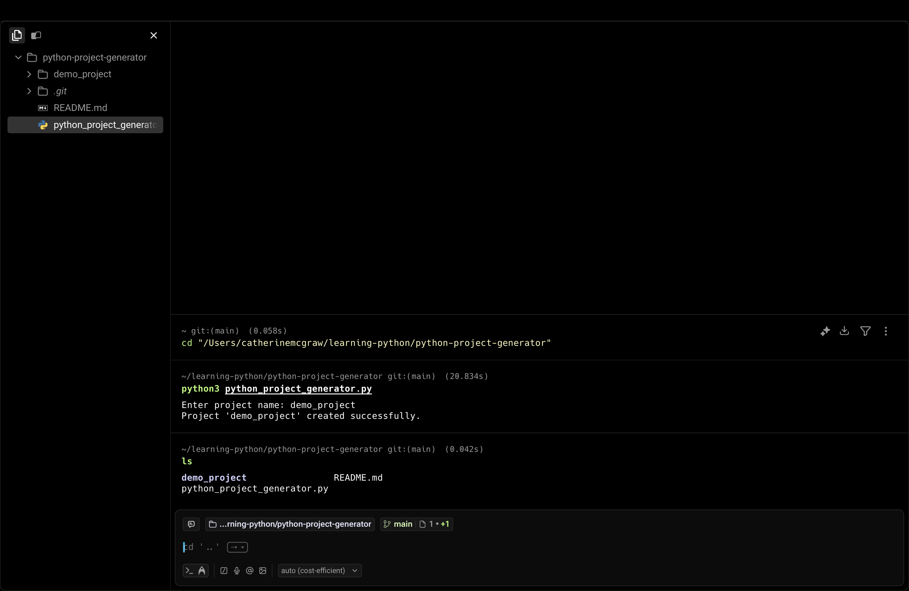

# Python Project Generator

A lightweight command-line tool that scaffolds a new Python project directory with a starter `main.py` file.

## Demo

## What It Does
- Prompts the user for a project name
- Prevents overwriting existing directories
- Creates a clean project folder
- Generates a runnable `main.py` entry point

## Why This Exists
This tool automates repetitive setup tasks and demonstrates clean, intentional Python scripting with user input validation and filesystem interaction.

## How to Use

python3 python_project_generator.py

Enter a project name when prompted.  
A new directory containing `main.py` will be created.

## Skills Demonstrated
- Python standard library usage
- Command-line interaction
- File and directory automation
- Input validation
- Clean project structure

